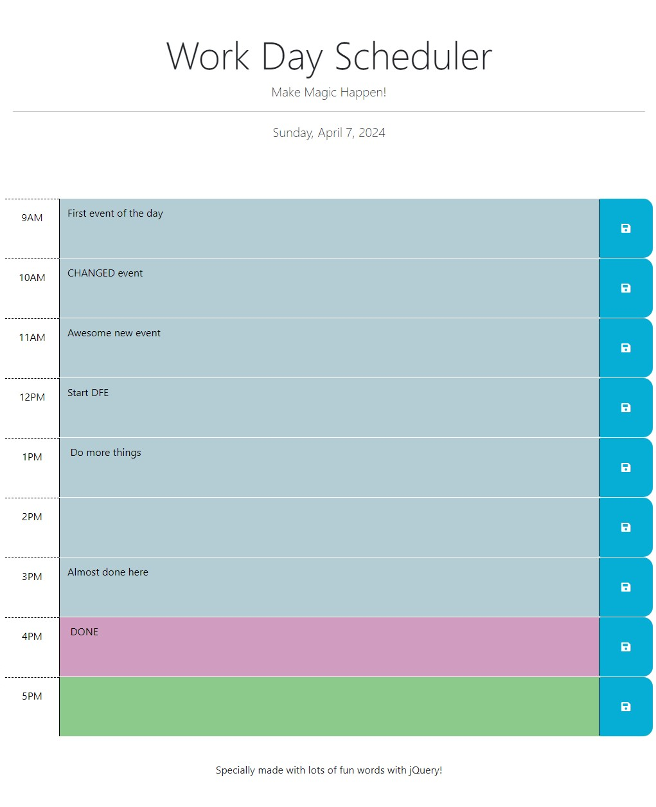

# Work Day Planner

####  

## Screenshot of Initial Build

Screenshot of the first build:

Initial Build for Simple Day Planner for Work 

## Table of Contents

PROJECT OVERVIEW

- [Project Title](#work-day-planner)

- [Screenshot](#screenshot-of-initial-build)

- [Description](#description)

- [Installation](#installation)

- [Usage](#usage)

---------------------

DEVELOPMENT ODYSSEY

- [Challenges](#challenges)

- [Test](#credits)

- [Contributions](#contributions)

- [Questions or Issues](#questions-issues)

---------------------

ADDITIONAL INFORMATION

- [Credits](#credits)

- [License](#license)

- [Authors and acknowledgment](#authors-and-acknowledgment)

- [Project Status](#project-status)

- [Future Features](#future-features)

## Description
As an employee with a busy schedule, I want to add important events to my daily planner, single use for that day so that I can manage my time effectively. This is a web based tool at this time. 

## Installation
No installtion needed, at this time

## Usage
Once the page is loaded you will just click in the time block you'd like to change, type what you'd like put in there, and click the save button on the right of that specific time block. There will be an alert button that comes up once properly saved. 

## Challenges

1. Getting the time blocks to show the approrpriate time
2. Getting the items stored to local storage
3. Getting the items to retrieve upon loading the page

## Test
interface testing as needed

Consistent testing throughout each iteration prior to deployment. 

## Contributions
Please submit all requests through my GitHub provided later in this readme

This is in a steady state until feature requests are submitted to the above email address and will be considered with owner approval.

## Questions or Issues
If you have any questions or encounter any issues, please don't hesitate to contact me through either of the following methods:

[GitHub Profile](https://github.com/kimberlyrobinson11122)

Email: me@me.com

## Credits
The project was developed iteratively with starter code.

## License
This application/project is covered under the MIT License.

## Authors and acknowledgment
Appreciation to the incredible Instructor, TAs, Tutors at EdX Berkeley.

## Project Status
This initial build is complete and was built to project specification.

## Future Features
Would like to build more functionality to this simple planner, to do list at the bottom, and checkbox of daily routines to run through.